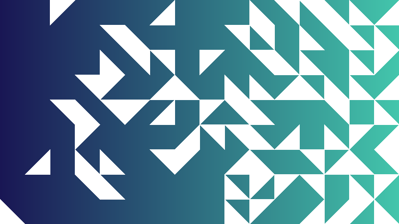

# Generative Geometric Designs

## Installation/Setup

Create and activate a virtual environment:
```
python3 -m venv venv
source venv/bin/activate
```

Install dependencies:
```
pip install -r requirements.txt
```

## Random Triangles



### Use

```
cd rand_triangles
python3 rand_triangles.py
```

### Parameters

Change these in `rand_triangles/triangle_params.yaml`

- `bg_type` (str):
  Whether to fill the background with an `image`, `gradient` or solid `color`
- `out_filename (str):
  Filename of the output image
- `fg_color` (str):
  Hex string of the color of the triangles
- `bg_image` (str):
  Path/filename of background image (used only if `bg_type` is `image`)
- `bg_color` (str):
  Hex string of background color (used only if `bg_type` is `color`)
- `bg_gradient` ([str, str]):
  List of 2 hex strings specifying start and end colors of the background gradient (used only if `bg_type` is `gradient`)
- `gradient_dir` (str):
  Direction of gradient, `horz` or `vert` (used for both gradient background and variable `fill_prob`
- `num_rows` (int):
  Number of rows of triangles. If `bg_type` is `image`, this determines the size of the rows and number of columns (`grid_dim` and `num_cols` will be ignored if set)
- `num_cols` (int):
  Number of columns of triangles. (Not used if `bg_type` is `image`)
- `grid_dim` (int):
  Dimensions (in pixels) of each row and column. (Not used if `bg_type` is `image`)
- `fill_prob` (number or [number number])
  What is the probability that a cell has a triangle in it? If set as a single number (in the range [0, 1]), the probability is constant across the image. If set as a list of two numbers, the probability will vary by row or column (depending on the value of `gradient_dir`)
- `fill_empty` (bool):
  If false, cells left empty by `fill_prob` will show the background color/image/gradient. If true, empty cells will be filled completely by the foreground color

## More maybe coming ~~soon~~ eventually